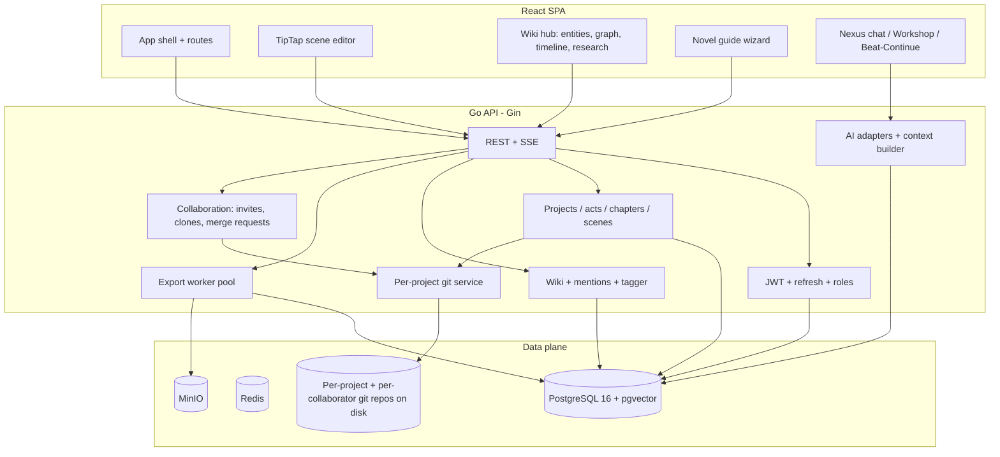

# NexusTale — architecture

A reference for how the system is actually built, as opposed to how it was
originally planned. For current work status and what's next, see
[ROADMAP.md](../ROADMAP.md). For contributor workflow, see
[CLAUDE.md](../CLAUDE.md).

---

## 1. Vision

NexusTale is a novel-writing platform that combines:

- Structured manuscript tooling (project → act → chapter → scene)
- **Git-backed** history and branching for narrative experiments (Chronicle,
  Lore, Echo, Diverge, TravelTo, Canonize)
- **Async, git-backed multi-user collaboration** — no real-time co-editing;
  co-authors work on separate branches and propose changes via merge requests
- A **world wiki** (entities, relationships, magic rules, timeline, story
  threads) wired into the manuscript and the AI context window
- **AI** (7 providers, cloud + local Ollama) for drafting, chat, agentic
  manuscript edits, and craft-focused editorial workshop sessions
- **Exports** to Markdown, DOCX, and EPUB (Scrivener/Fountain/PDF deferred —
  see ROADMAP.md Phase D)

Map builder and wiki image generation are Phase D — not yet built.

---

## 2. System architecture



**Principles**

- **PostgreSQL** is the source of truth for everything except manuscript
  prose — accounts, wiki graph, permissions, guide progress, AI usage
  accounting, and (via pgvector) embeddings for semantic retrieval.
- **Prose itself lives in git**, not the database (migration 029 dropped
  `scenes.content` — this was a deliberate "git-first" migration). Each
  project is a working git repo on disk; Chronicle = commit, Diverge =
  branch, Canonize = fast-forward merge.
- **Collaboration is git-backed, not real-time.** Each collaborator gets
  their own clone of the project repo on their own branch. There is no
  CRDT, no WebSocket sync, no live cursors — co-authors propose changes via
  merge requests (open/diff/resolve/merge), reviewed like a PR.
- **Redis** is provisioned but lightly used today (rate limiting); it is
  not a pub/sub hub for real-time collaboration, since there isn't any.
- **MinIO** (S3-compatible) holds wiki entity images and exported
  EPUB/DOCX files behind presigned URLs.

---

## 3. Backend (Go + Gin)

### 3.1 Package layout (`backend/internal/`)

| Package | Responsibility |
|---|---|
| `auth` | Register/login, JWT access + refresh, roles, API key storage (AES-256-GCM) |
| `project` | Projects, acts, chapters, scenes; orchestrates git commits on save |
| `wiki` | Entities, relationships, magic rules, timeline events, story threads, scene entity mention tagging |
| `ai` | Provider adapters, context builder (`BuildContext`), chat/beat/continue/workshop/summarize, agentic manuscript tools, embeddings |
| `collaboration` | Invites, per-collaborator clones, roles, `RequireProjectAccess`/`RequireChapterAccess` middleware |
| `merge` | Merge request open/diff/resolve/merge flow |
| `annotations` | Reviewer inline comments on manuscript text |
| `notifications` | Polling-based notification feed (invites, MR events) |
| `research` | Freeform per-project research notes, injectable into AI context |
| `threads` | Open/closed story thread tracker |
| `importer` | Parses `.md`/`.txt`/`.docx` into project/act/chapter/scene tree |
| `guide` | Novel guide wizard steps + story structure scoring |
| `export` | Markdown (sync), EPUB + DOCX (async worker pool → MinIO) |
| `admin` | Admin-only stats, user management, AI usage dashboard |
| `prompts` | Per-project writing style / system prompt presets |
| `waitlist` | Standalone invite-request form backend (not wired to registration gating) |
| `config` | Viper-based env config + `ValidateProd()` startup guard |
| `testutil` | Shared integration test harness (`SetupRouter`, DB cleanup) |

`backend/pkg/`: `db` (pool, migrations, sqlc-generated queries in
`db/sqlcgen`), `cache`, `storage` (MinIO client), `embedding` (OpenAI/Ollama
embedders + pgvector search), `apperror`.

### 3.2 API surface

- **REST** under `/api/v1/...` for all CRUD, wiki, collaboration, export,
  and guide operations.
- **SSE** (not WebSocket) for AI streaming — `/ai/complete`, `/ai/chat`,
  `/ai/workshop/:sid/chat` all stream via `io.Pipe` + `c.Stream`.
- No WebSocket endpoints exist; there is no real-time channel in the system.

### 3.3 Git versioning

- Each project is a non-bare git repo on disk (`GitConfig.ReposPath`), plus
  one additional clone per collaborator (`repos/{projectId}-collab-{userId}`).
- Commits happen on explicit user action (Chronicle), not on every keystroke.
- Branching (Diverge/TravelTo) backs both "what-if" solo drafting and
  collaborator branches; a per-repo-path mutex serializes writes.
- Conflict resolution is fast-forward-merge-or-reject (Canonize), with a
  word-level prose diff viewer for manual conflict resolution in merge
  requests — not automatic three-way merge.

### 3.4 AI integration

- **Adapters**: Anthropic, OpenAI, OpenRouter (dual-model: quality +
  background), Gemini, Groq, DeepSeek, Ollama.
- **Task-tier routing**: background tasks (summarize) use cheap/fast
  models; creative tasks (beat/continue) and analysis tasks (chat/workshop/
  agent) use stronger models. Writers can override per-call.
- **Context building** (`BuildContext`): project identity, story structure
  phase, magic systems, entities in scene, chapter summaries (semantic RAG
  via pgvector when embeddings exist, brute-force recency window as
  fallback), pinned context, current scene, open story threads — assembled
  under a hard character budget with a priority-drop policy.
- **Agentic tool use**: Workshop sessions can opt into manuscript write
  tools (append/replace scene, create scene/chapter/act) with a planning
  step, per-action undo, and a capped round loop.

### 3.5 Exports

Markdown is synchronous (zip stream). EPUB and DOCX run through an async
worker pool, write to MinIO, and are served via presigned URL with a
polling endpoint for job status.

---

## 4. Frontend (React)

### 4.1 Actual stack

| Choice | Notes |
|---|---|
| Vite + React 18 + TypeScript | |
| React Router v6 | client-side routing |
| Zustand | auth store, theme store — no Redux, no React Query |
| TipTap v3 (ProseMirror) | scene editor; entity mentions rendered as ProseMirror Decorations, not stored markup — plain-text round-trip preserved for backend storage |
| react-hook-form | forms (register, wiki entity forms) |
| d3 | wiki relationship graph (force layout, pan/zoom) |
| diff-match-patch | word-level prose diff viewer for merge request review |
| Tailwind CSS | with CSS-variable-based theming for light/dark |

There is no CRDT library, no Yjs, no WebSocket client — collaboration is
async over REST, per §2 above.

### 4.2 Structure (`frontend/src/`)

```
app/            # router, Zustand stores, App shell
pages/          # one file per route (Dashboard, ProjectHome, Editor, WikiHub, Guide, Admin, Settings, ...)
components/
  ai/           # ChatBar, WorkshopPanel, BeatInput, context panel
  editor/       # ScribeEditor (TipTap), entity mention extension, mentions bar
  wiki/         # entity detail, relationship graph, magic rule panel, timeline
  project/      # project explorer tree, scene metadata panel
  collaboration/# collaborator management, invite flows
  shared/       # generic UI primitives, error boundary
services/       # api.ts (hand-written fetch client) + api-types.ts (generated from openapi.yaml)
hooks/          # shared React hooks
```

### 4.3 Frontend ↔ backend contract

`docs/openapi.yaml` is the source of truth for routes documented in it;
`frontend/src/services/api-types.ts` is generated from it via
`npm run gen:api` — never hand-edited. Newer routes (AI, collaboration,
research, admin) were added faster than the spec catch-up and are typed
inline in `api.ts` — see ROADMAP.md's Phase D "OpenAPI catch-up" item.

Auth tokens: refresh token persists in `localStorage` (via Zustand
`persist`); the access token is deliberately **not** persisted — it lives
in memory only and is re-minted via silent refresh on page load, to shrink
the XSS token-theft surface.

---

## 5. Infrastructure

Three separate deployment paths exist, intentionally kept apart:

| Path | Audience | Files |
|---|---|---|
| **Local dev** | Contributors | `Makefile` (`make dev`/`make run`), `infra/docker/docker-compose.dev.yml` (Postgres+pgvector/Redis/MinIO only — run the Go API and Vite dev server directly on the host) |
| **Maintainer's dev VM** | The project maintainer | `infra/ansible/deploy-dev.yml`, triggered by `.github/workflows/dev.yml` on every push to `dev` — full auto-deploy including TLS/certbot, backups, health monitoring |
| **Public self-host** | Anyone self-hosting NexusTale | `infra/docker/docker-compose.selfhost.yml` + `.env.selfhost.example` — pulls public prebuilt GHCR images, no build step, no bundled TLS (bring your own reverse proxy) |

**CI/CD**: three GitHub Actions workflows, each producing different image
tags:

- `dev.yml` (push to `dev`, self-hosted runner) → `:dev` + `:<sha>`, then
  auto-deploys to the maintainer's dev VM
- `alpha.yml` (push to `master`) → `:alpha` + `:<sha>`, build-and-push only,
  no auto-deploy
- `release.yml` (push tag `vX.Y.Z`) → `:vX.Y.Z` + `:latest` — this is what
  self-hosters pin `NEXUSTALE_VERSION` to for reproducible upgrades

An additional Hetzner Terraform + Ansible scaffold exists
(`infra/terraform/`, `infra/ansible/deploy-prod.yml`) but has never been
provisioned — it's dormant infrastructure-as-code for a possible future
dedicated production box, not wired into any CI workflow.

**Object storage**: MinIO today. Its AGPLv3 license is a real
consideration only once a commercial paid tier exists (not the case yet);
Phase D plans a swap to `aws-sdk-go-v2/s3` targeting Cloudflare R2 behind
the same `pkg/storage` interface.
