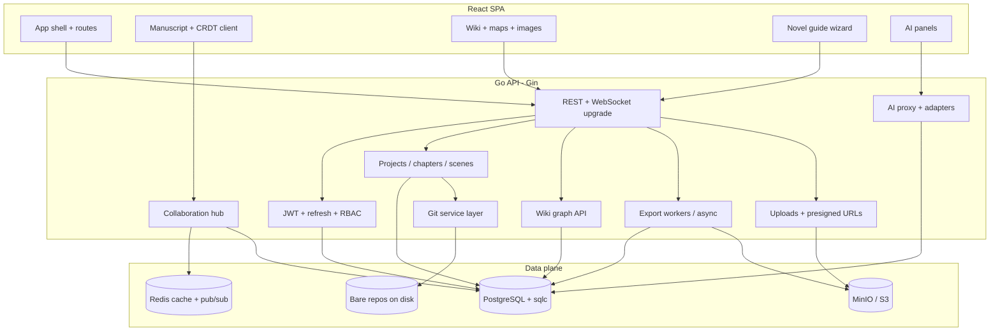

# NexusTale — end-to-end project plan

A single reference for **backend (Go + Gin)**, **frontend (React)**, and **feature domains**. Aligns with the existing API (`auth`, `projects`, chapters/scenes, Git-backed repos) and grows from there. See also [ROADMAP.md](../ROADMAP.md) and [CLAUDE.md](../CLAUDE.md).

---

## 1. Vision

NexusTale is a **novel-writing platform** that combines:

- Structured manuscript tooling (outline → chapters → scenes)
- **Git-backed** history and branching for narrative experiments
- **Multi-user** collaboration with clear roles
- A **world wiki** (entities, magic, timeline, plot) wired to the manuscript
- **AI** (local models + cloud APIs) for drafting, consistency, and research-style assistance
- **Exports** to common writer workflows (Markdown, Word, Scrivener, EPUB, Final Draft–class structures where feasible)
- **Rich worldbuilding**: reference images, optional **map builder**, **image generation** for wiki entries
- An **interactive, step-by-step guide** (“novel builder”) that teaches craft while driving the user through setup → world → plot → draft → revise

---

## 2. High-level architecture



**Principles**

- **PostgreSQL** is the source of truth for metadata, wiki graph, permissions, guide progress, and AI usage accounting.
- **Git** stores narrative content versions per project (or per branch); DB holds pointers, refs, and merge metadata.
- **Redis** backs sessions (optional), rate limits, pub/sub for multi-pod collaboration, and short-lived AI job status.
- **Object storage** holds exports, generated images, map assets, and large binaries.

---

## 3. Backend infrastructure (Go + Gin)

### 3.1 Service layout (packages)

| Layer | Responsibility |
|-------|----------------|
| `cmd/api` | Process entry: config, DB pool, migrations, router, graceful shutdown |
| `internal/config` | Viper/env; validate required secrets in production |
| `internal/auth` | Register/login, JWT access + refresh, middleware; later OAuth optional |
| `internal/project` | Projects, acts, chapters, scenes; orchestrates Git commits on meaningful saves |
| `internal/wiki` | Entities, types (character, location, faction, magic…), relationships, timeline events, plot beats, attachments |
| `internal/collaboration` | WebSocket hub, rooms per project/doc, CRDT/op sync; Redis fan-out |
| `internal/ai` | Provider adapters (Ollama, OpenAI, Anthropic, OpenRouter…), prompt templates, RAG/embeddings, quotas |
| `internal/export` | Pipelines to Markdown, DOCX, EPUB, Scrivener-compatible zip, Fountain, etc. |
| `internal/guide` | Novel-builder steps, user progress, unlock rules, links to created artifacts |
| `internal/media` | Presigned uploads, image job callbacks, map layer storage |
| `pkg/db` | Pool, migrations, **sqlc** queries only |
| `pkg/cache` | Interface: in-memory dev / Redis prod |
| `pkg/storage` | S3/MinIO client |

### 3.2 API surface (conceptual)

- **REST** `/api/v1/...` for CRUD, exports, guide state, wiki graph.
- **WebSocket** `/api/v1/projects/:id/collab` (or per-document) for real-time editing.
- **Optional SSE** for AI streaming tokens if you want chat without WS complexity.

### 3.3 Git versioning (backend behavior)

- Each **project** maps to a **bare repo** (already aligned with `git_repo_path`).
- **Commits** on explicit checkpoints: scene save, “snapshot,” branch create, merge.
- **Branches** for alternate plotlines or A/B drafts; API: list/create/merge/delete branch.
- DB tables: `git_ref` or store branch head SHA + metadata; tie scenes to blob IDs or paths in repo (`content/scenes/{id}.md`).
- **Conflict policy**: last-write-wins for simple MVP; CRDT/OT for collaboration reduces merge pain.

### 3.4 Collaboration (backend)

- **Roles**: owner, editor, commenter, viewer (extend `user_role` / `project_collaborators`).
- **Presence**: who’s online, which scene focused (Redis TTL keys).
- **Operations**: CRDT (e.g. Yjs-compatible binary over WS) or operational transform; persist periodically to DB + Git snapshot.
- **Multi-instance**: Redis pub/sub between Gin pods (as sketched in `internal/collaboration`).

### 3.5 AI integration (backend)

- **Unified internal API**: `Complete`, `Chat`, `Summarize`, `Embeddings`, `Image` (delegate to image provider or local).
- **Adapters**: interface per provider; config selects default + per-project overrides.
- **Local**: Ollama (and optional llama.cpp server) via HTTP.
- **Cloud**: OpenAI, Anthropic, OpenRouter, etc.; API keys server-side only.
- **Safety**: rate limits, token budgets, audit log of requests (hashed prompts optional), PII warnings in guide copy.
- **RAG**: pgvector (or separate table) for wiki + scene chunk embeddings; query at prompt-build time.

### 3.6 Exports (backend)

- **Synchronous** for small (single Markdown file).
- **Async job** for large (full project EPUB, Scrivener zip): job ID, poll or webhook, file in MinIO, time-limited download URL.
- **Mappers**: internal canonical model → target format (one module per format).

### 3.7 Media & image generation

- **Wiki images**: upload reference art; optional “generate from prompt” via configured image API (cloud) or local diffusion HTTP service.
- **Map builder**: store JSON (layers, pins linked to wiki entities) + rendered PNG/WebP preview in S3; version alongside project.

### 3.8 Novel guide (backend)

- **Guide definition**: versioned JSON or DB rows (steps, copy, prerequisites, linked templates).
- **User progress**: `guide_progress` per user per project (current step, completed flags, skipped optional steps).
- **Side effects**: guide actions call existing APIs (create wiki template entities, seed plot outline, open first scene).

### 3.9 Cross-cutting

- **Observability**: structured logs (`slog`), metrics, tracing on hot paths (AI, export, WS).
- **Testing**: table-driven unit tests; integration tests with testcontainers (Postgres, Redis) for auth and one collab path.

---

## 4. Frontend infrastructure (React)

### 4.1 Recommended stack (adjust to taste)

| Choice | Role |
|--------|------|
| **Vite + React + TypeScript** | Fast dev, simple deployment |
| **React Router** | SPA routing |
| **TanStack Query** | Server state, cache, mutations |
| **Zustand or Redux Toolkit** | UI-local state (editor, presence) |
| **TipTap or Lexical or CodeMirror 6** | Rich text for scenes; pick one and standardize |
| **Yjs + y-websocket or custom sync** | If CRDT matches backend protocol |
| **React Hook Form + Zod** | Forms (wiki, settings) |
| **Tailwind or CSS modules** | Styling; align with design system early |

### 4.2 App structure (folders)

```
frontend/
  src/
    app/           # providers, router, layout
    features/
      auth/
      dashboard/
      project/     # outline, manuscript, Git UI
      wiki/        # graph, entity detail, timeline, magic
      collab/      # presence, cursors (if CRDT)
      ai/          # chat, inline assist, model picker
      export/
      maps/        # map builder canvas
      guide/       # step wizard, progress
    api/           # generated or hand-written client
    components/    # shared UI
    lib/           # utils, tokens, websocket helpers
```

### 4.3 Key screens (UX map)

1. **Auth** — login/register, forgot password (later).
2. **Project list** — create, archive, collaborators.
3. **Project home** — novel guide CTA, outline, recent scenes, wiki shortcuts.
4. **Scene editor** — full screen, AI sidebar, save / snapshot / branch controls.
5. **Wiki** — entity list, filters by type, graph view, timeline, magic codex, plot summary page.
6. **Maps** — layer list, entity pins, export image.
7. **Exports** — format picker, job status, download.
8. **Settings** — AI providers (which cloud keys server uses is admin; user picks model prefs), theme, guide reset.

### 4.4 Frontend ↔ backend contracts

- OpenAPI or **openapi-typescript** codegen from a maintained `openapi.yaml` (generate when API stabilizes).
- **Auth**: store access token in memory + refresh in httpOnly cookie (preferred) or secure storage pattern you choose; align with existing JWT handlers.

---

## 5. Feature domains (detailed outline)

### 5.1 Git versioning

- **User stories**: snapshot before risky edit; branch “what-if”; compare diff; merge branch to main storyline.
- **Backend**: Git operations service; protect against repo corruption; async for heavy diffs.
- **Frontend**: branch picker, timeline of commits, diff viewer (text).
- **Dependencies**: stable on-disk layout, backups, path traversal hardening.

### 5.2 Co-author collaboration

- **User stories**: two editors same scene; comments; suggest mode (later).
- **Backend**: WS hub + Redis; persistence debounce; optional CRDT merge to Git.
- **Frontend**: presence avatars, CRDT provider, offline queue (stretch).
- **Dependencies**: role checks on every op; conflict UX copy.

### 5.3 Full wiki

| Sub-area | Content | Notes |
|----------|---------|--------|
| **World** | Settings, regions, cultures, tech level | Link scenes ↔ locations |
| **Characters** | Bios, arcs, relationships | Relationship graph edges |
| **Magic / systems** | Rules, costs, limits | Consistency checks via AI optional |
| **Timeline** | Dated events, eras | Sort + filter; link entities |
| **Plot** | Acts, beats, summaries | Acts are first-class DB entities (project → act → chapter → scene); hidden in UI when only one default act exists |

- **Data model**: generic `entities` + `entity_type` + JSON attributes vs normalized tables; start generic for speed, normalize hot paths later.
- **Autolink**: scan scene text for `@Entity` or wiki links; backend index optional.

### 5.4 AI integration (local + cloud)

- **Modes**: inline completion, chat, “lint” voice, summarize scene, generate alternate lines.
- **Model registry**: list models from Ollama + configured cloud; capability flags (vision, long context).
- **Cost control**: per-project daily caps; show estimated cost only for cloud.
- **Privacy**: local-first messaging in UI when using Ollama; data handling note in guide.

### 5.5 Export options (major platforms)

| Target | Purpose |
|--------|---------|
| **Markdown** | Universal, Git-friendly |
| **DOCX** | Word / editors |
| **EPUB** | e-readers |
| **Scrivener** | `.scriv` zip structure (document compatibility expectations) |
| **Fountain** | Screenplay-adjacent workflows |
| **PDF** | Sharing (optional, via renderer) |
| **Plain JSON** | Backup / migrations |

- Prioritize **Markdown + EPUB + DOCX** for MVP; add Scrivener when internal model is stable.

### 5.6 Image generation (wiki)

- Upload reference + optional “generate cover portrait for character X.”
- Store prompt metadata, model id, parent entity id; allow regenerate.
- Content policy: NSFW toggles, project-level disable.

### 5.7 World map builder

- **MVP**: image upload as basemap + draggable pins → wiki entities.
- **V2**: tiled map, layers (political / terrain), vector export.
- **Tech**: canvas (Konva, Pixi, or MapLibre if geo); save JSON + thumbnail to S3.

### 5.8 Step-by-step interactive novel guide

- **Structure**: linear steps with optional branches (e.g. “pantsing vs outlining”).
- **Each step**: short lesson, 1–3 actions in-app (create entity, write logline, outline act I).
- **Progress**: persistent; “resume guide” on login.
- **Content**: separate content pack (JSON/CMS) so writers can improve copy without redeploying logic.
- **Success**: user finishes with populated wiki skeleton + act outline + first scene draft.

---

## 6. Infrastructure & DevOps

### 6.1 Current state (as of 2026-04-09) ✅

- **Local dev**: `docker compose` (Postgres, Redis, MinIO) via `make dev`; API runs with `make run`.
- **CI/CD — dev branch**: GitHub Actions on a self-hosted runner (mgmt VM).
  - Push to `dev` → run `go test` → build & push API + frontend images to GHCR (`ghcr.io/helloworld44-89/nexustale/{api,frontend}:dev` and `:{sha}`).
  - Ansible playbook (`infra/ansible/deploy-dev.yml`) deploys to dev VM via `docker compose` pulling from GHCR.
  - Secrets stored as GitHub repository secrets.
- **Dev VM**: full stack running — API (port 8080), frontend/nginx (port 80), Postgres, Redis, MinIO.
- **nginx**: single `/api/` location block proxies REST + WebSocket; SPA fallback for React Router.
- **Images**: `infra/docker/Dockerfile.api` (multi-stage Go build), `infra/docker/Dockerfile.frontend` (Vite + nginx).
- **Deploy compose**: `infra/docker/docker-compose.deploy.yml` — pulls from GHCR, env vars from `.env` written by Ansible.

### 6.2 Remaining infra work

- **Environments**: `staging`, `prod` pipelines not yet built; follow same Ansible pattern.
- **Secrets**: currently GitHub repo secrets; move to Ansible Vault or a secret manager for prod.
- **CI additions**: frontend typecheck + lint, `sqlc diff` check to catch uncommitted regen.
- **K8s/Helm**: templates exist as stubs; fill when scaling beyond a single VM.
- **Ollama**: add as optional service in local compose for AI dev.

---

## 7. Phased delivery (suggested)

### Phase A — Product skeleton (MVP vertical)

**Actionable checklist:** [specs/phase-a-mvp.md](./specs/phase-a-mvp.md) (tasks **A0–A4** with acceptance criteria).

Summary: README + OpenAPI stub + infra honesty; Wiki v1 (sqlc + REST + tests); Git visibility API; React app (auth, projects, scene editor, wiki, minimal Git panel); CI/docs touch-up.

**Completed as of 2026-04-09:**
- ✅ Auth (register/login/refresh/logout), JWT middleware
- ✅ Projects, chapters, scenes — full CRUD + integration tests
- ✅ Git versioning — Chronicle/Lore/Echo/Diverge/TravelTo/Timelines/Canonize
- ✅ Wiki — entities, relationships, magic rules, timeline events (all with integration tests)
- ✅ Timeline relative anchoring — `anchor_event_id` + offset fields, DFS resolution with cycle detection (migration 006, unit tested)
- ✅ Frontend scaffold — React + Vite + TypeScript + Tailwind; auth, project list, scene editor, wiki components
- ✅ CI/CD — GitHub Actions (self-hosted runner) → GHCR → Ansible → dev VM; API + frontend deployed and reachable
- ✅ Bruno test collection — auth, projects, chapters, scenes, wiki (incl. anchor tests), git flows

**Completed (Phase A closed 2026-04-09):**
- ✅ Git handler integration tests — 21 tests covering full Chronicle/Lore/Echo/Diverge/TravelTo/Canonize flows
- ✅ Frontend wired to real API — scene editor autosave, wiki hub (entities + timeline CRUD), git panel
- ✅ OpenAPI spec (`docs/openapi.yaml`, 40 routes); TypeScript codegen (`npm run gen:api`)
- ✅ CI — frontend typecheck (`tsc --noEmit`), ESLint, API types drift check, `sqlc diff` check

**Act Structure — Phase 1 complete (2026-04-10):**

Hierarchy is now **Project → Act → Chapter → Scene**. Acts are required; a default "Act 1" is auto-created with every project and hidden in the UI when no additional acts exist.

- ✅ Migration 000009 — `acts` table, backfill one act per existing project, `chapters.act_id NOT NULL` FK
- ✅ sqlc — `acts.sql` (CRUD); `chapters.sql` updated (CreateChapter takes `act_id`, `ListChaptersByAct` added)
- ✅ Service — `CreateAct/GetAct/ListActs/UpdateAct/DeleteAct`; `CreateProject` auto-creates "Act 1"; `CreateChapter` now takes `actID`
- ✅ Handler routes — Act CRUD under `/projects/:id/acts`; chapters under `/projects/:id/acts/:aid/chapters`; scenes detached to `/chapters/:cid/scenes`
- ✅ OpenAPI spec updated — `ActResponse`, `CreateActRequest`, `UpdateActRequest` schemas; all paths updated
- ✅ TypeScript codegen — `npm run gen:api` regenerated `api-types.ts`

✅ **Act Structure — Phase 2** (integration tests + Bruno — complete 2026-04-10):
- Updated `handler_test.go` — chapter/scene tests use new routes; helpers `createProject`, `defaultActID`, `actChapterURL` added; `TestProjectCRUD` verifies default act creation
- New `act_handler_test.go` — `TestActCRUD`, `TestActDefaultCreatedWithProject`, `TestActCascadeDeletesChaptersAndScenes`, `TestActValidation`, `TestGetActNotFound`
- New `bruno/09-acts/` — list-acts (sets `actId` env var), create-act, get-act, update-act, delete-act
- Updated `bruno/04-chapters/` — added `00-setup-get-act.bru`; all chapter URLs use `/acts/{{actId}}/chapters`
- Updated `bruno/05-scenes/` — all scene URLs use `/chapters/{{chapterId}}/scenes`
- Updated `bruno/08-teardown/` — delete-chapter and delete-scene use new paths

✅ **Act Structure — Phase 3** (frontend — complete 2026-04-10):
- `api.ts` — `Act` type exported; `api.acts` (list/create/update/delete); `api.chapters.list/create` take `actId`; `api.scenes.list/create/update` use `/chapters/:cid/scenes` (projectId removed)
- `ProjectExplorer.tsx` — rewritten with `ActItem` interface; act layer shown/hidden based on `acts.length === 1 && title === 'Act 1'`; act-level collapse, per-act "new chapter" button, "new act" button in header; `ChapterRow` extracted as sub-component
- `Editor.tsx` — `ActWithChapters` state; load flow: acts → chapters → scenes; `handleCreateAct`, updated `handleCreateChapter(actId)`, `handleCreateScene(chapterId)` (no projectId); autosave uses new `api.scenes.update(chapterId, sceneId)`; `actTitle` derived and passed to TopBar
- `TopBar.tsx` — `actTitle` prop added; renders in breadcrumb between project and chapter, styled in `brand-purple`
- `SceneMetadataPanel.tsx` — `projectId` prop removed; `api.scenes.update` call updated to new 3-arg signature

✅ **Act Structure — Phase 3.5** (TypeScript build check + docs — complete 2026-04-10):
- `npx tsc --noEmit` — clean (zero errors) after all Phase 3 changes
- `PROJECT_PLAN.md` — all Act Structure phases documented with full bullet-point detail
- `ROADMAP.md` — current state table updated: hierarchy now "Project → Act → Chapter → Scene", migration 009, 45+ routes, acts in Bruno collection

### Phase B — AI + export core

**Full spec:** [specs/phase-b.md](./specs/phase-b.md)  
**Sub-specs:** [specs/phase-b-ai.md](./specs/phase-b-ai.md) · [specs/phase-b-export.md](./specs/phase-b-export.md) · [specs/phase-b-guide.md](./specs/phase-b-guide.md)

#### B1 — AI proxy + adapters ✅ complete
Wire the existing `internal/ai` package to HTTP routes. Adapters must implement a common interface so model providers are interchangeable.

- Adapter interface: `Complete`, `Chat`, `Summarize`, `StreamComplete`, `StreamChat`, `IsThinkingModel`
- `CompleteMode`: `continue` (append to scene) or `beat` (expand 1-sentence intent → 2–3 paragraphs of prose)
- Beat mode uses a system prompt template with `{title}/{genre}/{tense}/{pov}/{pov_character}` substitutions drawn from scene metadata
- Providers: OpenAI (gpt-4o-mini default), Anthropic (claude-haiku-4-5), Ollama (local, any model)
- Thinking model auto-detection (`o1`, `o3`, `deepseek-reasoner`, `qwq`, `r1`) → skip system prompt, fall back to batch + simulated streaming
- Route to provider via stored user API key (`internal/auth.DecryptAPIKey`)
- Routes: `POST /projects/:id/ai/complete` (with `mode`, `beat`, `prompt_id`), `/ai/chat`, `/ai/summarize`
- Frontend: ChatBar wired to `/ai/chat` with SSE streaming

#### B1.5 — Writing styles (prose prompts) ✅ complete
Named AI style presets stored per project. Writers can switch between "gritty noir" and "epic fantasy voice" without changing any settings.

- Migration 010: `project_prompts` table (`id, project_id, name, category, content, system_content, sort_order`); `user_api_keys.force_non_streaming BOOL`
- `category`: `prose` (for complete/beat) or `workshop` (for chat)
- `system_content` overrides the system prompt (template placeholders still substituted); `content` appended as style guidance to user turn
- Routes: `GET/POST /projects/:id/prompts`, `PUT/DELETE /projects/:id/prompts/:promptId`
- Frontend: writing style dropdown in SceneMetadataPanel; beat input field in ScribeEditor toolbar (send with `mode: "beat"`); streamed result appended with Accept/Retry/Discard actions

#### B2 — AI memory + context ✅ complete (2026-04-13)
Branch-isolated chapter summaries feed every AI call so the model has story context without manual copy-paste.

- ✅ Migration 012: `chapter_summaries(chapter_id, branch_name PK, ai_summary, stale, updated_at)` + `project_active_branch(project_id, user_id PK, branch_name, updated_at)`
- ✅ `ResolveBranch`: `X-NexusTale-Branch` header → `project_active_branch` DB row → `"canon"`
- ✅ `ScheduleSummarize`: marks stale immediately; debounced (30 s) LLM regeneration; debounce key is `(chapter_id, branch_name)`
- ✅ `BuildContext`: `## Story so far` from chapter summaries (active branch → canon fallback) + `## Referenced entities` for `@[Entity Name]` inline refs
- ✅ `SummaryNotifier` interface in `internal/project`; implemented by `ai.Service`; wired via `projectService.WithNotifier(aiService)` in `cmd/api/main.go`
- ✅ `TravelTo`/`Diverge` upsert `project_active_branch`; `Canonize` deletes merged branch summaries + user pointers
- ✅ `UpdateScene` fires `ScheduleSummarize` when content changes (userID + branch from request headers)
- ✅ New routes: `GET /projects/:id/chapters/:cid/summary`, `POST /projects/:id/chapters/:cid/summarize`
- ✅ Frontend: `X-NexusTale-Branch` header on all AI calls + scene saves; `currentBranch` state in Editor; chapter stale badge (amber dot) + Regenerate button in ProjectExplorer

#### B3 — Token usage tracking ✅ complete (2026-04-10)
Track cost per project so writers understand AI spend before it becomes a surprise.

- ✅ Migration 011: `ai_usage` table (user, project, model, tokens, cost_usd)
- ✅ Record after every AI call (best-effort, non-blocking)
- ✅ `GET /projects/:id/ai/usage` → aggregate (total tokens, estimated cost this month)
- ✅ Frontend: usage summary on ProjectHome stat cards

#### B4 — Export ✅ complete
Two export modes: fast synchronous Markdown for quick backup; async EPUB/DOCX for finished drafts.

- Markdown: walk acts → chapters → scenes, render `.md` with YAML front matter, zip and stream as `application/zip`
- EPUB + DOCX: async jobs queued to a goroutine pool; results uploaded to MinIO; polling endpoint returns presigned URL
- Migration 013: `export_jobs` table (`id, project_id, user_id, format, status, minio_key, error_msg, expires_at, created_at`)
- `status` enum: `pending | processing | done | failed`
- Routes: `POST /projects/:id/export` (body: `{format:"markdown"|"epub"|"docx"}`) → `{job_id}`; `GET /projects/:id/export/:job_id` → status + signed URL when done
- Markdown is synchronous (streamed zip response, no job row); EPUB and DOCX use the async path
- Frontend: Export panel on ProjectHome — Markdown "Download" button (direct fetch), EPUB/DOCX "Generate" → poll every 3 s → download link

#### B5 — Novel guide ✅ complete
A 5-step onboarding wizard that scaffolds a project from premise to first scene, pre-filling wiki and manuscript data. All steps are skippable.

- Steps: Premise → Core Characters → World Basics → Chapter Outline → First Scene
- Migration 014: `guide_steps` table (`project_id, step_key, data JSONB, completed_at`); PK `(project_id, step_key)`
- Each completed step writes real data (creates wiki entities, creates first chapter/scene)
- Frontend: `/projects/:id/guide` — linear wizard with progress bar; skippable; resumes from last incomplete step

#### B5.5 — Story structure (optional templates) ✅ complete (2026-04-14)
A library of 12 named story structures (Three-Act, Hero's Journey, Heist, Save the Cat, etc.) plus a scoring wizard that recommends one based on author answers. **Entirely optional** — freeform is a first-class choice, not a fallback. The app works identically with no structure selected.

- ✅ Migration 015: `novel_structures` (seeded with 12 templates) + nullable `projects.structure_id` + nullable `projects.structure_custom`
- ✅ sqlc: `ListNovelStructures`, `GetNovelStructure`, `GetProjectStructure`, `UpdateProjectStructure`
- ✅ Scoring matrix: deterministic Go function (`internal/guide/score.go`); 8 unit tests; min threshold 6 pts; secondary ≥70% of top score; empty slice → freeform recommended
- ✅ Routes: `GET /novel-structures` (public), `POST /projects/:id/guide/structure/score`, `GET/PUT /projects/:id/structure`
- ✅ Guide Step 3.5 (`StructureStep.tsx`): 4-path chooser — questionnaire (10 Qs → score call → result card), browse templates (accordion grid), freeform custom rules, skip; "Continue without structure" always visible
- ✅ `BuildContext` extended: injects `## Story structure` block (named: name + phase list; freeform: custom rules) — silently omitted when no structure set
- ✅ OpenAPI schemas + TypeScript codegen: `NovelStructureResponse`, `StructureScoreRequest/Response`, `ProjectStructureResponse`, `UpdateProjectStructureRequest`
- ✅ Structure badge on ProjectHome: shows structure name when selected; links to `?step=structure` in guide; silent when not set
- ✅ Timeline phase banners in WikiHub: events grouped by era (sorted by min year); muted italic phase banners overlaid above each era group when structure selected; display-only; no banner when no structure set

### Phase C — Polish + depth

Scale key: **Light** (1–2 files, contained) · **Medium** (new routes + frontend feature) · **Heavy** (new package/migration + multi-file frontend) · **Heavier** (multiple packages, complex state) · **Heaviest** (architectural, touches many systems)

#### C0 — Pre-C polish ✅ complete (2026-04-14)

- ✅ **`[Light]` Editor navigation** — TopBar fully redesigned: left nav (NexusTale logo → Dashboard, Home → ProjectHome, Wiki, Guide), center breadcrumb (project › act › chapter › scene), right area (panel toggles + username chip + Settings gear + logout button). `handleLogout` wired in Editor; `displayName` and `onLogout` props added to TopBar.
- ✅ **`[Light]` AI connection health check in Settings** — per-provider "Test" button for cloud keys; "Test Connection" for Ollama URL returns model list; all results expand inline with green/red panel; `POST /ai/test-connection` pings `/api/tags` (Ollama), `/v1/models` (OpenAI/Anthropic) with 8s timeout.
- ✅ **`[Light]` Nexus AI rename** — ChatBar renamed to "Nexus" with radial signal logo; on-theme intro message shown only when ≥1 API key is configured (`api.apiKeys.list` check on mount); no-connection message with link to Settings when no keys.
- ✅ **`[Light]` Per-user Ollama model selection** — `user_api_keys(provider="ollama_model")` stores chosen model; `ollamaModelForUser()` in AI service reads it, overriding config default; Settings Ollama card shows model list as clickable rows after Test Connection; clicking saves model immediately.

#### C0.5 — AI context quality ✅ complete (2026-04-14)

These fixes were prerequisite to AI being genuinely useful for writers — blocking before Phase C content features.

- ✅ **`[Medium]` BuildContext enrichment** — `BuildContext` now always injects project title/genres as a preamble. For chapters without AI summaries it falls back to raw scene content snippets (first 600 chars) so new/seeded projects have real context without requiring editor saves. Current scene full text labeled as "Current scene" is always included. `@[Entity]` lookup refactored to a single query (was N+1).
- ✅ **`[Light]` StreamChat identity** — Chat now always prepends a Nexus identity system prompt ("You are Nexus, an AI co-author…") so the model has role + project context even on the first message; context block appended to the identity prompt.
- ✅ **`[Heavy]` AI Bible (migration 016)** — `projects.ai_instructions TEXT` column; guide service `GenerateAIInstructions()` builds prose story bible (title, premise, theme, characters, world, magic systems) from completed guide steps; `AutoFillAIInstructions()` saves it when field is empty on any step completion. Three routes: `GET/PUT /projects/:id/ai-instructions` + `POST /projects/:id/ai-instructions/generate` (force-regenerate from guide, overwrites). `BuildContext` injects bible as `## Story bible` block above chapter content. ProjectHome AI Bible card: autosaving textarea (1.2s debounce) + "Regenerate from Guide" button.

#### C1 — Export depth ✅ complete

- ✅ **`[Medium]` DOCX export** — raw OOXML zip builder (`internal/export/docx.go`); Times New Roman 12pt double-spaced manuscript formatting; page breaks between chapters; italic centered scene headings; `# # #` scene breaks; no new dependency; `asyncJob{format}` generalizes the worker pool for EPUB + DOCX
- ✅ **`[Medium]` Wiki image upload** — migration 017 adds `image_key TEXT` to `wiki_entities`; multipart upload to backend → MinIO; `PresignedGetURL` returned in `EntityResponse.image_url` (4 hr TTL); `DeleteObject` cleans up on replace/remove/entity-delete; portrait display + upload/remove in `EntityDetail`; OpenAPI spec + types regenerated

#### C2 — AI depth

- ✅ **`[Heavy]` Explicit AI context panel** — migration 018 `ai_context_pins`; pin wiki entities/chapters/scenes/notes by name; `buildPinnedContext` section 6 in `BuildContext`; `ContextPanel.tsx` with entity/chapter/scene/note search tabs + mode toggle (summary/full); ActivityBar "Pin" button in Editor (2026-04-15)
- ✅ **`[Heavy]` Multi-session Workshop** — migration 019 `workshop_sessions`; `workshop_handler.go` (6 routes: CRUD + SSE chat); `SystemPromptOverride` field in `ChatRequest`; `workshopSystemPrompt()` falls back to `defaultWorkshopSystem`; `WorkshopPanel.tsx` (session sidebar, inline title editing, SSE streaming, Markdown export); ActivityBar "Workshop" button in Editor (2026-04-16)
- ✅ **`[Medium]` Research notes** — migration 020 `research_notes`; `internal/research` package (service + handler, 5 routes); notes listed by `project_id` (project-wide artifact); `ResearchNotesTab.tsx` in WikiHub "Research" tab (card grid, NoteDetail with auto-save); pinnable into AI context via `ContextPanel` notes tab + `appendPinnedNote` in `context.go` (2026-04-16)
- ✅ **`[Medium]` Prompt history browser** — migration 021 adds `mode TEXT`, `beat_text TEXT`, `scene_id UUID NULL` to `ai_usage`; `recordUsage` threads mode/beat/sceneID through from all call sites; `ListBeatHistory` sqlc query (DISTINCT ON beat_text, ordered by recency); `GET /projects/:id/ai/beat-history`; "Recent beats" list inside `BeatInput` (lazy-loaded on beat mode open; shown when input is empty; click to pre-fill; max 10 shown, max 32px tall scrollable) (2026-04-16)
- ✅ **`[Light]` Import/export writing styles** — download project style presets as JSON; import into another project from the same panel (2026-04-15)

#### C2.5 — AI manuscript tools (agent write access)

The author opts in to giving Nexus direct write access to the manuscript — the "Claude Code for your novel" layer. Gated by an explicit per-session toggle so it never surprises the writer.

**Step 1 — Quick wins, no backend changes** ✅ complete (2026-04-16)
- ✅ **`[Light]` Continue button** — "Continue →" pill in ScribeEditor toolbar alongside Beat; calls existing `api.ai.streamComplete(mode: 'continue')`; same Accept/Retry/Discard flow as BeatInput; `ContinueIcon` added; `openContinue()` auto-starts streaming on open
- ✅ **`[Light]` Insert into scene** — hover-reveal "insert into scene" button on every completed assistant message in Nexus chat (`ChatBar`) and Workshop (`WorkshopPanel`); `onInsertToScene?: (text: string) => void` prop on both panels; `handleInsertToScene` in `Editor.tsx` appends to active scene content + triggers autosave; button hidden when no scene is active

**Step 2 — Manuscript tool definitions** ✅ complete (2026-04-16)
- ✅ `adapters/tools.go`: `ToolDefinition/ToolCall/ToolResult/ToolChatResponse/ToolAdapter` interface; Anthropic + OpenAI implement `ChatTools` + `BuildToolResultMessages`
- ✅ `ai/tools.go`: `ManuscriptTools` (5 tools: append_to_scene, replace_scene_content, create_scene, create_chapter, create_act) + `executeToolCall` dispatcher
- ✅ `StreamChatWithTools` in service.go: max-10-round agentic loop, tool SSE events; Ollama falls back to `StreamChat` via type assertion
- ✅ WorkshopPanel Agent mode toggle; `tools_enabled` field in WorkshopChat request

**Step 3 — Author control + frontend feedback** ✅ complete (2026-04-17)
- ✅ `ToolEvent` struct in `tools.go` carries full undo metadata: `scene_id`, `chapter_id`, `before_content` for scene writes; `created_id`, `created_type`, `act_id`, `project_id` for creates — `executeToolCall` returns `(ToolResult, ToolEvent)`; `StreamChatWithTools` emits enriched SSE
- ✅ `api.ts`: `ToolCallEvent` type exported; `scenes.get/delete` + `chapters.delete` added; `onToolCall` callback now receives typed event
- ✅ WorkshopPanel: collapsible `AgentRunBlock` groups tool events per send() call with action count; per-action Undo button (scene write → restore content; creates → call delete endpoint); "Writes ON/OFF" toggle with agent-mode notice banner
- ✅ Editor: `handleToolWrite` fetches latest scene content after agent write (live refresh); `handleTreeRefresh` increments `refreshKey` to reload explorer after create undo; both wired to WorkshopPanel via `onToolWrite`/`onStructureChange`

**Step 4 — Agent mode in Workshop** ✅ complete (2026-04-17)
- ✅ `StreamChatWithTools` accepts `maxRounds int` (0 → default 25, up from const 10); emits `{agent_planning:true, round:N}` SSE event before each model round
- ✅ `workshop_handler.go`: reads `max_rounds` from request body, passes through
- ✅ `api.ts`: `onAgentPlanning` + `maxRounds` params on `workshop.streamChat`
- ✅ WorkshopPanel: `AgentPhase` state (idle/planning/executing/replying); status bar switches copy per phase with spinner; Stop button always visible during agent run; round counter in planning state; agent-optimized 2-row input + `AgentSendIcon`; passes `max_rounds:25` when tools enabled
- ✅ `NexusThinking` component: 18 general + 10 agent sci-fi/fantasy phrases, random start, 2.2s cycle with 0.3s fade, pulsing orb icon — wired into ChatBar, WorkshopPanel (agentMode when Writes ON), BeatInput (shown before first token arrives)

#### C3 — Collaboration (git-backed, async)

Novel collaboration is fundamentally **async** — co-authors work on different chapters at different times, editors annotate a draft and hand it back, reviewers read and comment. This makes a git-backed PR model a better fit than real-time CRDT for this domain.

**Architecture: per-collaborator git clones**

The project repo (`repos/{projectId}/`) has a single working tree; two users cannot be on different branches simultaneously in that tree. Solution: when a collaborator accepts an invite, the project repo is cloned to `repos/{projectId}/collab/{userID}/`. Each collaborator gets an independent working tree. All existing `GitService` methods (Chronicle, Lore, Diverge, Canonize, etc.) are reused — just called with the collaborator's clone path.

**Roles:**

| Role | Can do |
|---|---|
| `coauthor` | Add new chapters/scenes on their branch; Chronicle; open merge requests |
| `editor` | Same as coauthor; additionally adds suggestions via annotations |
| `reviewer` | Read-only access + create annotations (notes, highlights, questions) |

> **MVP scope note:** Co-authors and editors work additively (create new content on their branch). Editing existing canon scenes inline is deferred — the annotation system handles suggested changes to existing prose for now. Full branch-scoped DB content isolation is a C4/post-MVP concern.

**C3.0 — Collaborator roles + invite system** `[Medium]`

*Migration 022* — `project_invites` + `project_collaborators`:

```sql
CREATE TABLE project_invites (
  id          UUID PRIMARY KEY DEFAULT gen_random_uuid(),
  project_id  UUID NOT NULL REFERENCES projects(id) ON DELETE CASCADE,
  invited_by  UUID NOT NULL REFERENCES users(id),
  email       TEXT NOT NULL,
  role        TEXT NOT NULL CHECK (role IN ('coauthor','editor','reviewer')),
  token       TEXT NOT NULL UNIQUE,        -- 32-byte random hex, 7-day TTL
  accepted_at TIMESTAMPTZ,
  expires_at  TIMESTAMPTZ NOT NULL,
  created_at  TIMESTAMPTZ NOT NULL DEFAULT now()
);

CREATE TABLE project_collaborators (
  project_id  UUID NOT NULL REFERENCES projects(id) ON DELETE CASCADE,
  user_id     UUID NOT NULL REFERENCES users(id) ON DELETE CASCADE,
  role        TEXT NOT NULL CHECK (role IN ('coauthor','editor','reviewer')),
  branch_name TEXT NOT NULL,              -- e.g. "coauthor/alice", "editor/bob"
  clone_path  TEXT NOT NULL,             -- absolute path to their git clone
  invited_by  UUID NOT NULL REFERENCES users(id),
  joined_at   TIMESTAMPTZ NOT NULL DEFAULT now(),
  PRIMARY KEY (project_id, user_id)
);
```

*Invite model:* invitee must already have a NexusTale account (email matched on accept). No account-creation-via-invite in C3.

*`internal/collaboration` package:* `InviteCollaborator` · `AcceptInvite` (validates token → creates collaborator row → clones repo → Diverge to `role/username` branch) · `ListCollaborators` · `RemoveCollaborator`.

*Middleware — `RequireProjectAccess`:* passes if `userID == project.owner_id` OR a `project_collaborators` row exists; role enforced per-route (reviewer cannot Chronicle).

*Routes:*
```
POST   /projects/:id/invites                  → InviteCollaborator
GET    /invites/:token                        → GetInviteInfo (preview before accept)
POST   /invites/:token/accept                 → AcceptInvite
GET    /projects/:id/collaborators            → ListCollaborators
DELETE /projects/:id/collaborators/:uid       → RemoveCollaborator
```

*Frontend:* `CollaboratorsPanel.tsx` in ProjectHome (invite form, pending invites, member list with role badges + remove); `/invites/:token` accept page (shows project/inviter/role → "Join Project"); collaborator projects appear in their project list (ListProjects unions owner + collaborator rows).

**C3.1 — Collaborator-scoped git operations** `[Medium]`

Add `repoPathForUser(ctx, projectID, userID)` in the git handler: returns `project.GitRepoPath` for owner, `collaborator.ClonePath` for collaborators. All existing Chronicle/Lore/Timelines/Echo routes call this — no new routes needed, collaborators use the same endpoints.

Branch scoping: collaborator can only Diverge/TravelTo branches matching their assigned `branch_name` prefix. Validated in the handler before delegating to GitService.

**C3.2 — Merge request system** `[Heavy]`

*Migration 023* — `merge_requests`:

```sql
CREATE TABLE merge_requests (
  id           UUID PRIMARY KEY DEFAULT gen_random_uuid(),
  project_id   UUID NOT NULL REFERENCES projects(id) ON DELETE CASCADE,
  from_branch  TEXT NOT NULL,
  to_branch    TEXT NOT NULL DEFAULT 'canon',
  title        TEXT NOT NULL,
  description  TEXT NOT NULL DEFAULT '',
  requested_by UUID NOT NULL REFERENCES users(id),
  status       TEXT NOT NULL DEFAULT 'open'
               CHECK (status IN ('open','approved','rejected','merged')),
  reviewer_note TEXT NOT NULL DEFAULT '',
  created_at   TIMESTAMPTZ NOT NULL DEFAULT now(),
  resolved_at  TIMESTAMPTZ
);
```

*Service functions:* `OpenMergeRequest` · `ListMergeRequests` · `GetMergeRequestDiff` (fetches collaborator branch from clone into main repo via go-git local fetch; runs Echo between canon HEAD and branch HEAD; parses into per-scene hunks keyed by git path `scenes/{id}.md`) · `ResolveMergeRequest` (approve/reject/merge; on merge calls Canonize; if HasParadox surfaces conflict resolution flow).

*Routes:*
```
POST   /projects/:id/merge-requests                     → OpenMergeRequest
GET    /projects/:id/merge-requests                     → ListMergeRequests
GET    /projects/:id/merge-requests/:mid                → GetMergeRequest
GET    /projects/:id/merge-requests/:mid/diff           → GetMergeRequestDiff
PUT    /projects/:id/merge-requests/:mid                → UpdateStatus
POST   /projects/:id/merge-requests/:mid/resolve        → SubmitConflictResolution
```

**C3.3 — Prose diff + conflict resolution UI** `[Heavy — frontend focus]`

`ProseDiffViewer.tsx` — per-scene word-level diff using `diff-match-patch` (tiny, no heavy deps):

```
┌─────────────────────────────────────────────────┐
│ Scene: "The Duel at Irongate"                   │
│ [Canon]                │ [Co-author]            │
│ The knight raised his  │ Sir Aldric drew his    │
│ sword—                 │ blade, eyes blazing—   │
│                                                 │
│ [← Keep Canon]  [Use Co-author →]  [Edit ✎]    │
└─────────────────────────────────────────────────┘
```

- Additions highlighted green, deletions red-strikethrough
- Three resolution options per scene: keep canon / keep co-author / open inline manual editor
- All scenes must be resolved before "Merge" button enables
- "Accept All Co-author" / "Accept All Canon" bulk buttons
- Conflict-free MRs (fast-forward only, most co-author MRs): read-only diff + single "Merge" button

**C3.4 — Reviewer annotations** `[Medium]`

*Migration 024* — `manuscript_annotations`:

```sql
CREATE TABLE manuscript_annotations (
  id          UUID PRIMARY KEY DEFAULT gen_random_uuid(),
  project_id  UUID NOT NULL REFERENCES projects(id) ON DELETE CASCADE,
  scene_id    UUID NOT NULL REFERENCES scenes(id) ON DELETE CASCADE,
  author_id   UUID NOT NULL REFERENCES users(id),
  start_char  INT NOT NULL,
  end_char    INT NOT NULL,
  body        TEXT NOT NULL,
  type        TEXT NOT NULL DEFAULT 'note'
              CHECK (type IN ('note','suggestion','question')),
  resolved    BOOLEAN NOT NULL DEFAULT false,
  resolved_by UUID REFERENCES users(id),
  created_at  TIMESTAMPTZ NOT NULL DEFAULT now()
);
```

*Routes:*
```
GET    /projects/:id/scenes/:sid/annotations          → ListAnnotations
POST   /projects/:id/scenes/:sid/annotations          → CreateAnnotation
PUT    /projects/:id/scenes/:sid/annotations/:aid     → UpdateAnnotation
DELETE /projects/:id/scenes/:sid/annotations/:aid     → DeleteAnnotation
```

*Frontend:* Highlight text in ScribeEditor → "Add note" popover → type → save. Annotations rendered as colored underlines by char offset range. Click → popover with note + author + resolve button (owner only). `AnnotationSidebar.tsx` right panel lists all scene annotations; click to jump to offset. Type badges: note (yellow), suggestion (blue), question (purple). Access: reviewer/editor can create; only owner can resolve.

**C3.5 — Notifications** `[Light]`

*Migration 025* — `notifications`:

```sql
CREATE TABLE notifications (
  id          UUID PRIMARY KEY DEFAULT gen_random_uuid(),
  user_id     UUID NOT NULL REFERENCES users(id) ON DELETE CASCADE,
  project_id  UUID REFERENCES projects(id) ON DELETE CASCADE,
  type        TEXT NOT NULL,
              -- 'invite_received','mr_opened','mr_approved','mr_rejected','mr_merged','annotation_added'
  payload     JSONB NOT NULL DEFAULT '{}',
  read_at     TIMESTAMPTZ,
  created_at  TIMESTAMPTZ NOT NULL DEFAULT now()
);
CREATE INDEX ON notifications(user_id, read_at) WHERE read_at IS NULL;
```

Polling model (60 s interval) — no WebSocket required. `NotificationBell.tsx` in TopBar: unread badge count, dropdown with notification cards, click marks read + navigates to relevant MR/annotation. Rows created server-side at event time (invite sent, MR opened, etc.).

*Routes:*
```
GET  /notifications             → ListNotifications (unread + last 20 read)
PUT  /notifications/:id/read    → MarkRead
PUT  /notifications/read-all    → MarkAllRead
```

**Build order:** C3.0 → C3.1 → C3.5 → C3.2 → C3.3 → C3.4
(C3.0+C3.1 are coupled; C3.5 early so every subsequent step can fire notifications; C3.3 is the longest frontend task — give it its own session)

**Migration map:**

| # | Name | Contents |
|---|---|---|
| 022 | `user_plan` | `users.plan TEXT DEFAULT 'free'` — added early so C3 invite handler can gate on owner plan at invite time |
| 023 | `collaboration` | `project_invites` + `project_collaborators` |
| 024 | `merge_requests` | merge request tracking |
| 025 | `manuscript_annotations` | inline reviewer notes |
| 026 | `notifications` | in-app notification inbox |

### Phase D — Premium / advanced

- Map builder v2; image generation pipelines
- Scrivener/Fountain; advanced Git branching UX
- Multi-region, scale-out collab tuning
- **Keyboard shortcuts** — writer-defined hotkeys for common editing actions (bold, italic, scene save, beat trigger, focus mode, etc.); shortcut map to be specified before implementation
- **Customizable workspaces** — per-user, per-project saved panel layouts (open panels, widths, active scene/chapter); named presets ("drafting", "research", "editing") switchable from the TopBar; `user_workspaces` table (JSONB layout blob); synced across sessions so the editor reopens exactly where the writer left off

### Monetization (deferred — to be designed before launch)

Likely a free tier + paid tiers model. Proposed shape:

| Tier | Target | Key limits |
|---|---|---|
| **Free** | Hobbyists, evaluators | 1 project, Ollama/local AI only, no collaboration |
| **Writer** (~$10/mo) | Serious solo authors | Unlimited projects, cloud AI (bring-your-own key), all AI features |
| **Studio** (~$20/mo) | Co-authors, editors | Everything + C3 collaboration features, team management |

**Principles to lock before implementation:**
- Exports are free at every tier — a writer's manuscript is never held hostage.
- AI features use bring-your-own-key; NexusTale does not pay for AI compute on behalf of users.
- `users.plan TEXT DEFAULT 'free'` column added in migration 022 (already created). Plan-check middleware + Stripe/Paddle webhook handler still needed when billing is implemented.
- Usage already tracked (`ai_usage` table) — cost-visibility features are already 80% built.

---

## 8. Risks & open decisions

| Risk | Mitigation |
|------|------------|
| Prose merge conflicts confusing for writers | Diff UI must be word-level, not raw git markers; ProseDiffViewer abstracts this |
| Per-collaborator git clone disk usage | Clones share git object store via hardlinks on Linux; acceptable for novel-scale repos |
| Scrivener format fragility | Document “best effort”; start with documented subset |
| AI cost spikes | Quotas, caching summaries, smaller models for lint tasks |
| Scope creep | Ship guide + wiki + editor before map builder v2 |
| Branch-scoped DB content (C3 MVP gap) | Additive model + annotations covers most collab cases; full inline editing of canon scenes deferred to C4 |

**Decisions locked**

- Collaboration model: git-backed async PR flow (not CRDT/WebSocket). Per-collaborator repo clones for working tree isolation.
- Invite model (C3): requires existing NexusTale account. No account-creation via invite link in C3.
- Canonical scene format in Git: Markdown files at `scenes/{id}.md`.
- DB stays on Postgres with recursive CTEs (no graph DB).

---

## 9. Next actions

### Phase A+ — Pre-Phase B polish

**Completed:**
- ✅ A+1 — Word count + scene metadata (`SceneMetadataPanel`, migration 007, server-side word count)
- ✅ A+2 — Secure AI key storage (migration 008, AES-256-GCM, `/users/me/api-keys`, `/settings` page)
- ✅ A+3 — Autolink wired in editor (debounced wiki entity match badges in WikiPanel)

**All complete** ([full spec](./specs/phase-aplus.md)):
- ✅ **Act Phase 2** — Complete (see Phase A section above)
- ✅ **Act Phase 3** — Complete (see Phase A section above)
- ✅ **Act Phase 3.5** — Complete (TypeScript clean, PROJECT_PLAN + ROADMAP updated)
- ✅ A+4 — Focus/distraction-free mode (`F11` toggle; hides all chrome; floating `Esc` button; focus icon in TopBar)
- ✅ A+5 — Project home/stats page (`GET /projects/:id/stats` SQL aggregate; `ProjectHome` page at `/projects/:id`; editor at `/projects/:id/editor`)
- ✅ A+6 — User account deletion (`DELETE /users/me` + `GET /users/me`; git cleanup on disk; danger zone confirm dialog in settings)
- ✅ A+7 — Light theme (CSS variables in tailwind config; `:root`/`.light` overrides; themeStore; toggle in settings; `prefers-color-scheme` fallback)
- ✅ A+8 — Relationship graph visualization (d3 force-directed; nodes by entity type; edge labels; pan/zoom; click → entity detail; WikiHub "Graph" tab)

### Phase B — status

- ✅ **B1** — AI proxy + adapters
- ✅ **B1.5** — Writing styles + beat input
- ✅ **B2** — AI memory + context window (2026-04-13)
- ✅ **B3** — Token tracking
- ✅ **B4** — Export (2026-04-13)
  - `internal/export`: `markdown.go` (zip stream), `epub.go` (go-epub → MinIO), `docx.go` (raw OOXML), `service.go` (worker pool, `asyncJob{format}`), `handler.go`
  - Migration 013: `export_jobs` table; `pkg/storage` MinIO client
  - Routes: `POST /projects/:id/export` (format: `"markdown"|"epub"|"docx"`), `GET /projects/:id/export`, `GET /projects/:id/export/:job_id`
  - Frontend: Export panel on ProjectHome — Markdown download (direct fetch → blob), EPUB + DOCX async with 3 s polling; DOCX added 2026-04-15
- ✅ **Ollama Docker fix** — per-user configurable base URL stored in `user_api_keys(provider="ollama")`; Settings page "Local AI (Ollama)" section

- ✅ **B5** — Novel guide wizard
  - Migration 014: `guide_steps(project_id, step_key PK, data JSONB, completed_at)`
  - 5 steps: Premise → Characters → World → Outline → First Scene
  - Routes: `GET /projects/:id/guide`, `POST /projects/:id/guide/:step`, `POST /projects/:id/guide/:step/complete`
  - Frontend: `/projects/:id/guide` — stepper wizard; skippable; resumes from last incomplete step; "Start Guide" CTA on ProjectHome
- ✅ **B5.5** — Story structure templates (2026-04-14; see B5.5 section above)

**Remaining (Phase C — in order):**

**C1 — Export depth** ✅ complete
- ✅ `[Medium]` **DOCX export** — raw OOXML builder (`internal/export/docx.go`); Times New Roman 12pt double-spaced; page breaks between chapters; scene headings italic centered; `# # #` scene breaks; no new dependency; worker pool generalized to `asyncJob{format}`; "Export DOCX" button + polling in ProjectHome
- ✅ `[Medium]` **Wiki image upload** — migration 017 (`image_key TEXT`); multipart upload handler; MinIO `PutObject`/`DeleteObject`; `PresignedGetURL` in `EntityResponse.image_url`; portrait + upload/remove UI in `EntityDetail`

**C2 — AI depth**
- ✅ `[Heavy]` **Explicit AI context panel** — migration 018; `ContextPanel.tsx`; entity/chapter/scene/note search tabs; `buildPinnedContext` in `BuildContext`
- ✅ `[Heavy]` **Multi-session Workshop** — migration 019 `workshop_sessions`; `workshop_handler.go`; `WorkshopPanel.tsx`; SSE chat; Markdown export; `SystemPromptOverride` in `ChatRequest`
- ✅ `[Medium]` **Research notes** — migration 020 `research_notes`; `internal/research`; `ResearchNotesTab.tsx` in WikiHub; pinnable via context panel; `appendPinnedNote` in `context.go`
- ✅ `[Medium]` **Prompt history browser** — migration 021; `mode/beat_text/scene_id` on `ai_usage`; `ListBeatHistory` query; `GET /ai/beat-history`; "Recent beats" in BeatInput
- ✅ `[Light]` **Import/export writing styles** — JSON round-trip for prose presets across projects

**C2.5 — AI manuscript tools** ✅ complete (2026-04-17)
- ✅ `[Light]` **Continue button** — "Continue →" in ScribeEditor; streams `mode=continue`; Accept/Retry/Discard
- ✅ `[Light]` **Insert into scene** — hover-reveal on Nexus + Workshop messages; `onInsertToScene` prop wired in Editor
- ✅ `[Medium]` **Manuscript tool definitions** — `append_to_scene/replace/create_scene/create_chapter/create_act`; server-side execution; `ToolEvent` SSE with undo metadata; OpenAI + Anthropic adapter support
- ✅ `[Medium]` **Author control + feedback** — "Writes ON/OFF" toggle; collapsible AgentRunBlock with per-action Undo; live scene refresh; `onStructureChange` for create undos
- ✅ `[Heavy]` **Agent mode** — max 25 rounds; `agent_planning` SSE events; AgentPhase state machine; NexusThinking cycling annotations

**C3 — Collaboration (git-backed async)**
- ✅ `[Medium]` **C3.0** — Collaborator roles + invite system (migrations 022 + 023; `internal/collaboration`; `CollaboratorsPanel`; accept page; project list union)
- ✅ `[Medium]` **C3.1** — Collaborator-scoped git operations (`repoPathForUser`; branch-prefix enforcement; reviewer read-only on Chronicle/Diverge; all existing git routes reused; 44 Bruno tests in `10-collaboration/`)
- ✅ `[Light]`  **C3.5** — Notifications (migration 026; `internal/notifications` service + handler; `GET /notifications`, `PUT /notifications/:id/read`, `PUT /notifications/read-all`; `NotificationWriter` interface in collab service; `invite_received` fires on invite; `NotificationBell.tsx` — 60s polling, unread badge, dropdown, mark-read + navigate on click; extensible to any future event type via `type TEXT` + `payload JSONB`)
- ☐ `[Heavy]`  **C3.2** — Merge request system (migration 024; diff via go-git local fetch + Echo; Canonize on approve; conflict surfaces HasParadox)
- ☐ `[Heavy]`  **C3.3** — Prose diff + conflict resolution UI (`ProseDiffViewer`; word-level diff-match-patch; per-scene keep/blend; bulk accept)
- ☐ `[Medium]` **C3.4** — Reviewer annotations (migration 025; char-offset overlay in ScribeEditor; `AnnotationSidebar`; note/suggestion/question types)

### Infrastructure
10. **Staging/prod pipelines** — clone dev Ansible playbook; parameterize environment; add prod secrets to vault.
11. **Ollama in local compose** — optional service for AI dev without cloud keys.

This plan is meant to evolve — trim or reorder phases based on your first beta cohort’s feedback.
