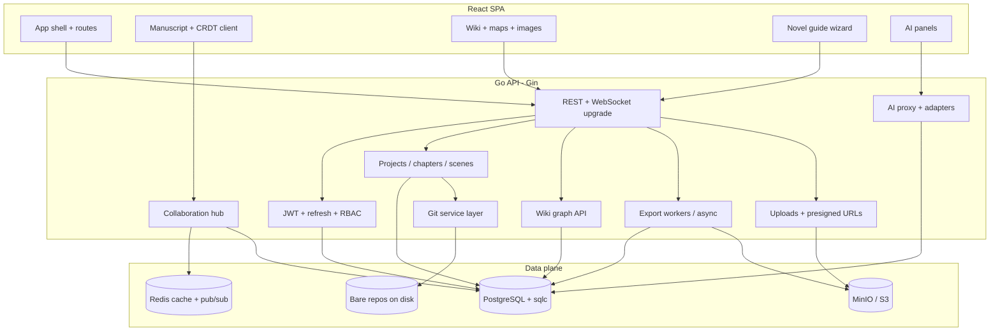

# NexusTale — end-to-end project plan

A single reference for **backend (Go + Gin)**, **frontend (React)**, and **feature domains**. Aligns with the existing API (`auth`, `projects`, chapters/scenes, Git-backed repos) and grows from there. See also [ROADMAP.md](../ROADMAP.md) and [CLAUDE.md](../CLAUDE.md).

---

## 1. Vision

NexusTale is a **novel-writing platform** that combines:

- Structured manuscript tooling (outline → chapters → scenes)
- **Git-backed** history and branching for narrative experiments
- **Multi-user** collaboration with clear roles
- A **world wiki** (entities, magic, timeline, plot) wired to the manuscript
- **AI** (local models + cloud APIs) for drafting, consistency, and research-style assistance
- **Exports** to common writer workflows (Markdown, Word, Scrivener, EPUB, Final Draft–class structures where feasible)
- **Rich worldbuilding**: reference images, optional **map builder**, **image generation** for wiki entries
- An **interactive, step-by-step guide** (“novel builder”) that teaches craft while driving the user through setup → world → plot → draft → revise

---

## 2. High-level architecture



**Principles**

- **PostgreSQL** is the source of truth for metadata, wiki graph, permissions, guide progress, and AI usage accounting.
- **Git** stores narrative content versions per project (or per branch); DB holds pointers, refs, and merge metadata.
- **Redis** backs sessions (optional), rate limits, pub/sub for multi-pod collaboration, and short-lived AI job status.
- **Object storage** holds exports, generated images, map assets, and large binaries.

---

## 3. Backend infrastructure (Go + Gin)

### 3.1 Service layout (packages)

| Layer | Responsibility |
|-------|----------------|
| `cmd/api` | Process entry: config, DB pool, migrations, router, graceful shutdown |
| `internal/config` | Viper/env; validate required secrets in production |
| `internal/auth` | Register/login, JWT access + refresh, middleware; later OAuth optional |
| `internal/project` | Projects, chapters, scenes; orchestrates Git commits on meaningful saves |
| `internal/wiki` | Entities, types (character, location, faction, magic…), relationships, timeline events, plot beats, attachments |
| `internal/collaboration` | WebSocket hub, rooms per project/doc, CRDT/op sync; Redis fan-out |
| `internal/ai` | Provider adapters (Ollama, OpenAI, Anthropic, OpenRouter…), prompt templates, RAG/embeddings, quotas |
| `internal/export` | Pipelines to Markdown, DOCX, EPUB, Scrivener-compatible zip, Fountain, etc. |
| `internal/guide` | Novel-builder steps, user progress, unlock rules, links to created artifacts |
| `internal/media` | Presigned uploads, image job callbacks, map layer storage |
| `pkg/db` | Pool, migrations, **sqlc** queries only |
| `pkg/cache` | Interface: in-memory dev / Redis prod |
| `pkg/storage` | S3/MinIO client |

### 3.2 API surface (conceptual)

- **REST** `/api/v1/...` for CRUD, exports, guide state, wiki graph.
- **WebSocket** `/api/v1/projects/:id/collab` (or per-document) for real-time editing.
- **Optional SSE** for AI streaming tokens if you want chat without WS complexity.

### 3.3 Git versioning (backend behavior)

- Each **project** maps to a **bare repo** (already aligned with `git_repo_path`).
- **Commits** on explicit checkpoints: scene save, “snapshot,” branch create, merge.
- **Branches** for alternate plotlines or A/B drafts; API: list/create/merge/delete branch.
- DB tables: `git_ref` or store branch head SHA + metadata; tie scenes to blob IDs or paths in repo (`content/scenes/{id}.md`).
- **Conflict policy**: last-write-wins for simple MVP; CRDT/OT for collaboration reduces merge pain.

### 3.4 Collaboration (backend)

- **Roles**: owner, editor, commenter, viewer (extend `user_role` / `project_collaborators`).
- **Presence**: who’s online, which scene focused (Redis TTL keys).
- **Operations**: CRDT (e.g. Yjs-compatible binary over WS) or operational transform; persist periodically to DB + Git snapshot.
- **Multi-instance**: Redis pub/sub between Gin pods (as sketched in `internal/collaboration`).

### 3.5 AI integration (backend)

- **Unified internal API**: `Complete`, `Chat`, `Summarize`, `Embeddings`, `Image` (delegate to image provider or local).
- **Adapters**: interface per provider; config selects default + per-project overrides.
- **Local**: Ollama (and optional llama.cpp server) via HTTP.
- **Cloud**: OpenAI, Anthropic, OpenRouter, etc.; API keys server-side only.
- **Safety**: rate limits, token budgets, audit log of requests (hashed prompts optional), PII warnings in guide copy.
- **RAG**: pgvector (or separate table) for wiki + scene chunk embeddings; query at prompt-build time.

### 3.6 Exports (backend)

- **Synchronous** for small (single Markdown file).
- **Async job** for large (full project EPUB, Scrivener zip): job ID, poll or webhook, file in MinIO, time-limited download URL.
- **Mappers**: internal canonical model → target format (one module per format).

### 3.7 Media & image generation

- **Wiki images**: upload reference art; optional “generate from prompt” via configured image API (cloud) or local diffusion HTTP service.
- **Map builder**: store JSON (layers, pins linked to wiki entities) + rendered PNG/WebP preview in S3; version alongside project.

### 3.8 Novel guide (backend)

- **Guide definition**: versioned JSON or DB rows (steps, copy, prerequisites, linked templates).
- **User progress**: `guide_progress` per user per project (current step, completed flags, skipped optional steps).
- **Side effects**: guide actions call existing APIs (create wiki template entities, seed plot outline, open first scene).

### 3.9 Cross-cutting

- **Observability**: structured logs (`slog`), metrics, tracing on hot paths (AI, export, WS).
- **Testing**: table-driven unit tests; integration tests with testcontainers (Postgres, Redis) for auth and one collab path.

---

## 4. Frontend infrastructure (React)

### 4.1 Recommended stack (adjust to taste)

| Choice | Role |
|--------|------|
| **Vite + React + TypeScript** | Fast dev, simple deployment |
| **React Router** | SPA routing |
| **TanStack Query** | Server state, cache, mutations |
| **Zustand or Redux Toolkit** | UI-local state (editor, presence) |
| **TipTap or Lexical or CodeMirror 6** | Rich text for scenes; pick one and standardize |
| **Yjs + y-websocket or custom sync** | If CRDT matches backend protocol |
| **React Hook Form + Zod** | Forms (wiki, settings) |
| **Tailwind or CSS modules** | Styling; align with design system early |

### 4.2 App structure (folders)

```
frontend/
  src/
    app/           # providers, router, layout
    features/
      auth/
      dashboard/
      project/     # outline, manuscript, Git UI
      wiki/        # graph, entity detail, timeline, magic
      collab/      # presence, cursors (if CRDT)
      ai/          # chat, inline assist, model picker
      export/
      maps/        # map builder canvas
      guide/       # step wizard, progress
    api/           # generated or hand-written client
    components/    # shared UI
    lib/           # utils, tokens, websocket helpers
```

### 4.3 Key screens (UX map)

1. **Auth** — login/register, forgot password (later).
2. **Project list** — create, archive, collaborators.
3. **Project home** — novel guide CTA, outline, recent scenes, wiki shortcuts.
4. **Scene editor** — full screen, AI sidebar, save / snapshot / branch controls.
5. **Wiki** — entity list, filters by type, graph view, timeline, magic codex, plot summary page.
6. **Maps** — layer list, entity pins, export image.
7. **Exports** — format picker, job status, download.
8. **Settings** — AI providers (which cloud keys server uses is admin; user picks model prefs), theme, guide reset.

### 4.4 Frontend ↔ backend contracts

- OpenAPI or **openapi-typescript** codegen from a maintained `openapi.yaml` (generate when API stabilizes).
- **Auth**: store access token in memory + refresh in httpOnly cookie (preferred) or secure storage pattern you choose; align with existing JWT handlers.

---

## 5. Feature domains (detailed outline)

### 5.1 Git versioning

- **User stories**: snapshot before risky edit; branch “what-if”; compare diff; merge branch to main storyline.
- **Backend**: Git operations service; protect against repo corruption; async for heavy diffs.
- **Frontend**: branch picker, timeline of commits, diff viewer (text).
- **Dependencies**: stable on-disk layout, backups, path traversal hardening.

### 5.2 Co-author collaboration

- **User stories**: two editors same scene; comments; suggest mode (later).
- **Backend**: WS hub + Redis; persistence debounce; optional CRDT merge to Git.
- **Frontend**: presence avatars, CRDT provider, offline queue (stretch).
- **Dependencies**: role checks on every op; conflict UX copy.

### 5.3 Full wiki

| Sub-area | Content | Notes |
|----------|---------|--------|
| **World** | Settings, regions, cultures, tech level | Link scenes ↔ locations |
| **Characters** | Bios, arcs, relationships | Relationship graph edges |
| **Magic / systems** | Rules, costs, limits | Consistency checks via AI optional |
| **Timeline** | Dated events, eras | Sort + filter; link entities |
| **Plot** | Acts, beats, summaries | Connect to chapters/scenes (many-to-many) |

- **Data model**: generic `entities` + `entity_type` + JSON attributes vs normalized tables; start generic for speed, normalize hot paths later.
- **Autolink**: scan scene text for `@Entity` or wiki links; backend index optional.

### 5.4 AI integration (local + cloud)

- **Modes**: inline completion, chat, “lint” voice, summarize scene, generate alternate lines.
- **Model registry**: list models from Ollama + configured cloud; capability flags (vision, long context).
- **Cost control**: per-project daily caps; show estimated cost only for cloud.
- **Privacy**: local-first messaging in UI when using Ollama; data handling note in guide.

### 5.5 Export options (major platforms)

| Target | Purpose |
|--------|---------|
| **Markdown** | Universal, Git-friendly |
| **DOCX** | Word / editors |
| **EPUB** | e-readers |
| **Scrivener** | `.scriv` zip structure (document compatibility expectations) |
| **Fountain** | Screenplay-adjacent workflows |
| **PDF** | Sharing (optional, via renderer) |
| **Plain JSON** | Backup / migrations |

- Prioritize **Markdown + EPUB + DOCX** for MVP; add Scrivener when internal model is stable.

### 5.6 Image generation (wiki)

- Upload reference + optional “generate cover portrait for character X.”
- Store prompt metadata, model id, parent entity id; allow regenerate.
- Content policy: NSFW toggles, project-level disable.

### 5.7 World map builder

- **MVP**: image upload as basemap + draggable pins → wiki entities.
- **V2**: tiled map, layers (political / terrain), vector export.
- **Tech**: canvas (Konva, Pixi, or MapLibre if geo); save JSON + thumbnail to S3.

### 5.8 Step-by-step interactive novel guide

- **Structure**: linear steps with optional branches (e.g. “pantsing vs outlining”).
- **Each step**: short lesson, 1–3 actions in-app (create entity, write logline, outline act I).
- **Progress**: persistent; “resume guide” on login.
- **Content**: separate content pack (JSON/CMS) so writers can improve copy without redeploying logic.
- **Success**: user finishes with populated wiki skeleton + act outline + first scene draft.

---

## 6. Infrastructure & DevOps

- **Local**: existing `docker compose` (Postgres, Redis, MinIO); add optional Ollama service in compose for dev.
- **Environments**: `dev`, `staging`, `prod`; secrets via env or secret manager.
- **CI**: `go test`, lint, `sqlc diff` check; frontend typecheck + test + build.
- **CD**: container image for API; static SPA to CDN or same origin behind reverse proxy.
- **K8s/Helm**: fill templates when you have real images, ingress, and secrets; optional for early stage.

---

## 7. Phased delivery (suggested)

### Phase A — Product skeleton (MVP vertical)

**Actionable checklist:** [specs/phase-a-mvp.md](./specs/phase-a-mvp.md) (tasks **A0–A4** with acceptance criteria).

Summary: README + OpenAPI stub + infra honesty; Wiki v1 (sqlc + REST + tests); Git visibility API; React app (auth, projects, scene editor, wiki, minimal Git panel); CI/docs touch-up.

### Phase B — Guide + AI + export core

- Novel guide backend + wizard UI (happy path only)
- AI proxy: one cloud + Ollama; chat + summarize
- Export: Markdown zip + EPUB (async job + download)

### Phase C — Collaboration + depth

- WebSocket + CRDT for scene editing; roles and invites
- Timeline + plot wiki views; graph visualization
- DOCX export; image upload for wiki

### Phase D — Premium / advanced

- Map builder v2; image generation pipelines
- Scrivener/Fountain; advanced Git branching UX
- Multi-region, scale-out collab tuning

---

## 8. Risks & open decisions

| Risk | Mitigation |
|------|------------|
| CRDT + Git semantics clash | Define “source of truth” windows; snapshot to Git on idle or explicit save |
| Scrivener format fragility | Document “best effort”; start with documented subset |
| AI cost spikes | Quotas, caching summaries, smaller models for lint tasks |
| Scope creep | Ship guide + wiki + editor before map builder v2 |

**Decisions to lock early**

- CRDT library and wire protocol (Yjs vs Automerge vs OT-only).
- Canonical scene format in Git (Markdown with front matter vs JSON).
- Whether plot/wiki uses graph DB later or stays in Postgres with recursive CTEs.

---

## 9. Next actions (convert to tickets)

1. Execute **[Phase A spec](./specs/phase-a-mvp.md)**; tick boxes in [ROADMAP.md](../ROADMAP.md) as you ship.
2. Add **OpenAPI** stub for existing routes; generate TypeScript client for React.
3. Schema design doc for **wiki relationships + timeline** beyond Phase A v1 (extend `docs/specs/` when needed).
4. Spike: **one WebSocket** echo + auth for collaboration proof of concept.

This plan is meant to evolve—trim or reorder phases based on your first beta cohort’s feedback.
